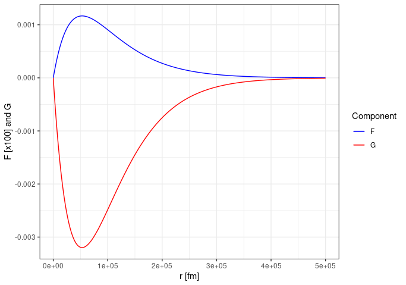

# Dirac

## Solve the Dirac Equation for Hydrogen (electron + proton)

### Dr. Jonathan Carroll, PhD; Original ca 2010. Revised 2023.

This Fortran code was written to solve the Dirac equation for _muonic_ hydrogen, but has
been retrofitted to solve for regular hydrogen. Some comments removing additional
functionality remain for context or for re-use.

A (draft?) copy of the research article relevant to this calculation is
[included](https://github.com/jonocarroll/Dirac/blob/main/muH.pdf). This contains the 
relevant equations and a brief explanation of the approach.

## Running the program

1. Download or clone this repository, e.g. `git clone git@github.com:jonocarroll/Dirac.git`
1. Edit the `Makefile` to use whichever Fortran compiler you have. This has been tested with `gfortran`
1. Ensure a clean start with `make clean` which removes all `.o` and `.mod` files as well as the compiled binary
1. Compile the code with `make` (which automatically builds `make Dirac`)
1. Run the program with `./Dirac` which will perform the integration and produce the `Wavefunctions.dat` data file. 
   This will take some time, but provides progress updates to the terminal
1. Use your favourite plotting program to visualise the `F` and `G` components of the spinor

## Editing Configuration

Two solvers are implemented; [Runge-Kutta](https://en.wikipedia.org/wiki/Runge%E2%80%93Kutta_methods)
and [Adams-Bashforth](https://en.wikipedia.org/wiki/Linear_multistep_method#Adams%E2%80%93Bashforth_methods). These
are selected by changing the
[`solving_method` parameter](https://github.com/jonocarroll/Dirac/blob/d94cd1988a0e5ccef8351424acd57a1c5950981f/FindEigenvalue.f90#L31-L32).

The step-size, maximum number of iterations, and other shared parameters are found in the
[shared.f90](https://github.com/jonocarroll/Dirac/blob/main/shared.f90) file. As this code was originally designed for
muonic hydrogen, many equations still refer to that, but I have set `m_muon = m_electron` as a shortcut to
solving for traditional hydrogen.

The Coulomb potential is set to the point distribution in [funcs.f90](https://github.com/jonocarroll/Dirac/blob/main/funcs.f90)
but this can be changed to a finite charge distribution if desired. Additional integration is required in that case, in which
case the additional required files are provided (as-is, without any cleanup) in the
[integration/](https://github.com/jonocarroll/Dirac/tree/main/integration) subdirectory.

The 1s state is solved for by default, but this can be changed by setting the
[`state`](https://github.com/jonocarroll/Dirac/blob/164fbcf5581fc054ed3b6c71de123a17e699e6db/FindEigenvalue.f90#L68)
variable. Three options are available; the 1s, 2s, and 2p states. Coding for additional states requires
adjusting many parameters including the known number of nodes, etc...

## Questions

I'm happy to take questions, but keep in mind I haven't really worked on this for more than a dozen years, so
my memory of how all the pieces fit together is limited. You can contact me either via 
[Issues here](https://github.com/jonocarroll/Dirac/issues/new/choose) or my website, 
[jcarroll.com.au](https://jcarroll.com.au).

